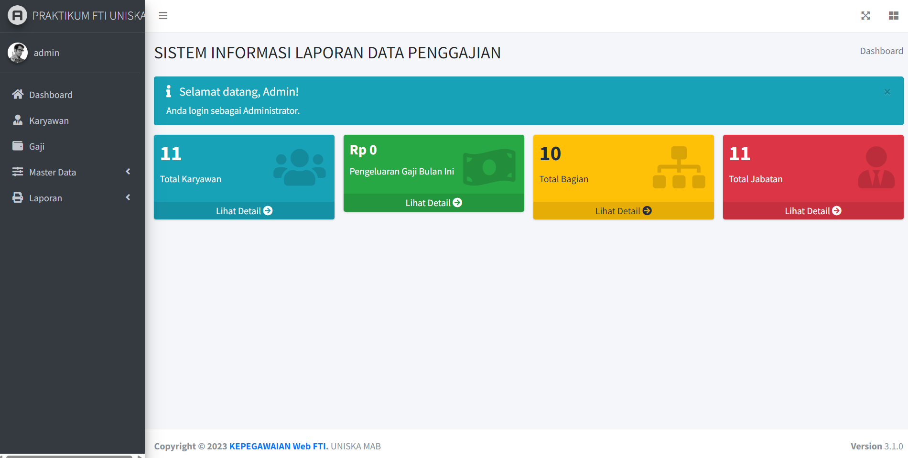
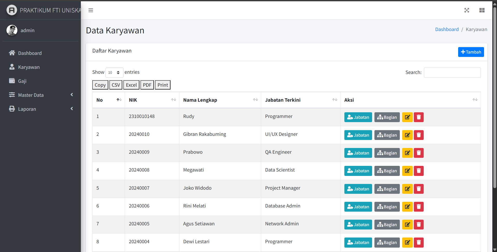
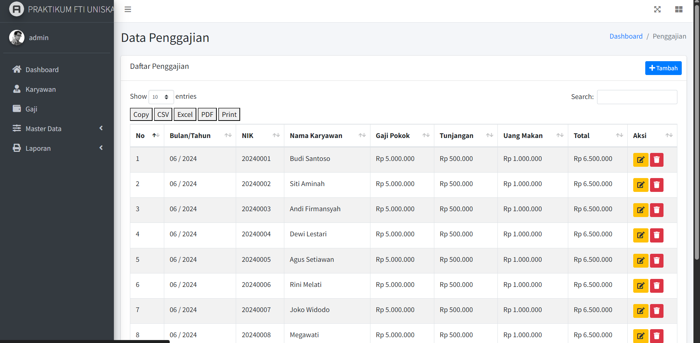
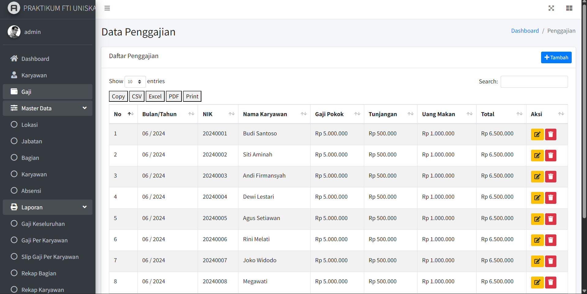

# Praktikum Semester 6 – Sistem Informasi Kepegawaian (FTI UNISKA)

A simple **PHP CRUD** admin interface built on **AdminLTE 3** (Bootstrap 4) for managing employee data. This project is part of the Praktikum course for **Sistem Informasi Kepegawaian** at **FTI UNISKA**.

---  

## Screenshots  

| Overview | Employees | Salary Report |
|----------|-----------|--------------|
|  |  |  |
|  |  |  |

*Add additional screenshots (`SS5.png`, `SS6.png`, …) following the same pattern.*

---  

## PDF Report  

The **Rekap Gaji** report can be downloaded from the `assets` folder:

[Rekap Gaji _ PRAKTIKUM FTI UNISKA (PDF)](assets/Rekap%20Gaji%20_%20PRAKTIKUM%20FTI%20UNISKA.pdf)

---  

## Project Structure  

```
├─ admin/                # AdminLTE‑based backend pages
│   ├─ laporan/          # Report pages (rekap‑gaji, …)
│   └─ …                 # Other admin panels
├─ assets/               # Static assets (PDFs, images, etc.)
│   └─ Rekap Gaji _ PRAKTIKUM FTI UNISKA.pdf
├─ index.php             # Login entry point
├─ koneksi.php           # DB connection (mysqli)
├─ .env                  # DB credentials (ignored by git)
└─ README.md             # THIS FILE
```

---  

## Quick Start  

1. **Clone the repo**  
   ```bash
   git clone https://github.com/<your‑username>/<repo‑name>.git
   cd <repo‑name>
   ```

2. **Create the database** (see `koneksi.php` for the expected schema)  
   ```sql
   CREATE DATABASE db_uniska_praktikum_semester_6;
   ```

3. **Install dependencies** (AdminLTE assets are already included)  
   ```bash
   # If you need to rebuild AdminLTE assets
   npm install
   npm run production
   ```

4. **Configure the environment** – copy `.env.example` → `.env` and fill in DB credentials.

5. **Run with a local PHP server**  
   ```bash
   php -S localhost:90
   ```
   Open `http://localhost:90/` in your browser.

---  

## Usage  

- **Login** – admin users (`ADMIN`) or normal users (`USER`) are defined in `koneksi.php`.  
- **Dashboard** – navigate the sidebar to manage *Pegawai*, *Jabatan*, and generate the **Rekap Gaji** PDF.  
- **Print / Export** – the “Print” button now uses a custom header/footer (center‑aligned) and the PDF title matches the report name.

---  

## Security & Best Practices  

- All DB queries have been **converted to prepared statements** (see `admin/laporan/rekap‑gaji.php`).  
- Passwords are stored with `password_hash()` and verified with `password_verify()`.  
- Sessions are regenerated on login to prevent fixation.  
- **Never** commit the real `.env` file – it’s already in `.gitignore`.

---  

## License  

This educational project is released under the **MIT License**. Feel free to fork, modify, and use it for your own learning.

---  

*— Your Name / NIM – FTI UNISKA*

A simple **PHP CRUD** admin interface built on **AdminLTE 3** (Bootstrap 4) for managing employee data. This project is part of the Praktikum course for **Sistem Informasi Kepegawaian** at **FTI UNISKA**.

---  

## Screenshots  

| Overview | Employees | Salary Report |
|----------|-----------|--------------|
|  |  |  |
|  |  |  |

*Add additional screenshots (`SS5.png`, `SS6.png`, …) following the same pattern.*

---  

## PDF Report  

The **Rekap Gaji** report can be downloaded from the `assets` folder:

[Rekap Gaji _ PRAKTIKUM FTI UNISKA (PDF)](assets/Rekap%20Gaji%20_%20PRAKTIKUM%20FTI%20UNISKA.pdf)

---  

## Project Structure  

```
├─ admin/                # AdminLTE‑based backend pages
│   ├─ laporan/          # Report pages (rekap‑gaji, …)
│   └─ …                 # Other admin panels
├─ assets/               # Static assets (PDFs, images, etc.)
│   └─ Rekap Gaji _ PRAKTIKUM FTI UNISKA.pdf
├─ index.php             # Login entry point
├─ koneksi.php           # DB connection (mysqli)
├─ .env                  # DB credentials (ignored by git)
└─ README.md             # THIS FILE
```

---  

## Quick Start  

1. **Clone the repo**  
   ```bash
   git clone https://github.com/<your‑username>/<repo‑name>.git
   cd <repo‑name>
   ```

2. **Create the database** (see `koneksi.php` for the expected schema)  
   ```sql
   CREATE DATABASE db_uniska_praktikum_semester_6;
   ```

3. **Install dependencies** (AdminLTE assets are already included)  
   ```bash
   # If you need to rebuild AdminLTE assets
   npm install
   npm run production
   ```

4. **Configure the environment** – copy `.env.example` → `.env` and fill in DB credentials.

5. **Run with a local PHP server**  
   ```bash
   php -S localhost:90
   ```
   Open `http://localhost:90/` in your browser.

---  

## Usage  

- **Login** – admin users (`ADMIN`) or normal users (`USER`) are defined in `koneksi.php`.  
- **Dashboard** – navigate the sidebar to manage *Pegawai*, *Jabatan*, and generate the **Rekap Gaji** PDF.  
- **Print / Export** – the “Print” button now uses a custom header/footer (center‑aligned) and the PDF title matches the report name.

---  

## Security & Best Practices  

- All DB queries have been **converted to prepared statements** (see `admin/laporan/rekap‑gaji.php`).  
- Passwords are stored with `password_hash()` and verified with `password_verify()`.  
- Sessions are regenerated on login to prevent fixation.  
- **Never** commit the real `.env` file – it’s already in `.gitignore`.

---  

## License  

This educational project is released under the **MIT License**. Feel free to fork, modify, and use it for your own learning.

---  

*— Your Name / NIM – FTI UNISKA*

A simple **PHP CRUD** admin interface built on **AdminLTE 3** (Bootstrap 4) for managing employee data. This project is part of the Praktikum course for **Sistem Informasi Kepegawaian** at **FTI UNISKA**.

---  

## Screenshots  

| Overview | Employees | Salary Report |
|----------|-----------|--------------|
|  |  |  |
|  |  |  |

*Add additional screenshots (`SS5.png`, `SS6.png`, …) following the same pattern.*

---  

## PDF Report  

The **Rekap Gaji** report can be downloaded from the `assets` folder:

[Rekap Gaji _ PRAKTIKUM FTI UNISKA (PDF)](assets/Rekap%20Gaji%20_%20PRAKTIKUM%20FTI%20UNISKA.pdf)

---  

## Project Structure  

```
├─ admin/                # AdminLTE‑based backend pages
│   ├─ laporan/          # Report pages (rekap‑gaji, …)
│   └─ …                 # Other admin panels
├─ assets/               # Static assets (PDFs, images, etc.)
│   └─ Rekap Gaji _ PRAKTIKUM FTI UNISKA.pdf
├─ index.php             # Login entry point
├─ koneksi.php           # DB connection (mysqli)
├─ .env                  # DB credentials (ignored by git)
└─ README.md             # THIS FILE
```

---  

## Quick Start  

1. **Clone the repo**  
   ```bash
   git clone https://github.com/<your‑username>/<repo‑name>.git
   cd <repo‑name>
   ```

2. **Create the database** (see `koneksi.php` for the expected schema)  
   ```sql
   CREATE DATABASE db_uniska_praktikum_semester_6;
   ```

3. **Install dependencies** (AdminLTE assets are already included)  
   ```bash
   # If you need to rebuild AdminLTE assets
   npm install
   npm run production
   ```

4. **Configure the environment** – copy `.env.example` → `.env` and fill in DB credentials.

5. **Run with a local PHP server**  
   ```bash
   php -S localhost:90
   ```
   Open `http://localhost:90/` in your browser.

---  

## Usage  

- **Login** – admin users (`ADMIN`) or normal users (`USER`) are defined in `koneksi.php`.  
- **Dashboard** – navigate the sidebar to manage *Pegawai*, *Jabatan*, and generate the **Rekap Gaji** PDF.  
- **Print / Export** – the “Print” button now uses a custom header/footer (center‑aligned) and the PDF title matches the report name.

---  

## Security & Best Practices  

- All DB queries have been **converted to prepared statements** (see `admin/laporan/rekap‑gaji.php`).  
- Passwords are stored with `password_hash()` and verified with `password_verify()`.  
- Sessions are regenerated on login to prevent fixation.  
- **Never** commit the real `.env` file – it’s already in `.gitignore`.

---  

## License  

This educational project is released under the **MIT License**. Feel free to fork, modify, and use it for your own learning.

---  

*— Your Name / NIM – FTI UNISKA*

A simple **PHP CRUD** admin interface built on **AdminLTE 3** (Bootstrap 4) for managing employee data. This project is part of the Praktikum course for **Sistem Informasi Kepegawaian** at **FTI UNISKA**.

---  

## Screenshots  

| Overview | Employees | Salary Report |
|----------|-----------|--------------|
|  |  |  |
|  |  |  |

*Add additional screenshots (`SS5.png`, `SS6.png`, …) following the same pattern.*

---  

## PDF Report  

The **Rekap Gaji** report can be downloaded from the `assets` folder:

[Rekap Gaji _ PRAKTIKUM FTI UNISKA (PDF)](assets/Rekap%20Gaji%20_%20PRAKTIKUM%20FTI%20UNISKA.pdf)

---  

## Project Structure  

```
├─ admin/                # AdminLTE‑based backend pages
│   ├─ laporan/          # Report pages (rekap‑gaji, …)
│   └─ …                 # Other admin panels
├─ assets/               # Static assets (PDFs, images, etc.)
│   └─ Rekap Gaji _ PRAKTIKUM FTI UNISKA.pdf
├─ index.php             # Login entry point
├─ koneksi.php           # DB connection (mysqli)
├─ .env                  # DB credentials (ignored by git)
└─ README.md             # THIS FILE
```

---  

## Quick Start  

1. **Clone the repo**  
   ```bash
   git clone https://github.com/<your‑username>/<repo‑name>.git
   cd <repo‑name>
   ```

2. **Create the database** (see `koneksi.php` for the expected schema)  
   ```sql
   CREATE DATABASE db_uniska_praktikum_semester_6;
   ```

3. **Install dependencies** (AdminLTE assets are already included)  
   ```bash
   # If you need to rebuild AdminLTE assets
   npm install
   npm run production
   ```

4. **Configure the environment** – copy `.env.example` → `.env` and fill in DB credentials.

5. **Run with a local PHP server**  
   ```bash
   php -S localhost:90
   ```
   Open `http://localhost:90/` in your browser.

---  

## Usage  

- **Login** – admin users (`ADMIN`) or normal users (`USER`) are defined in `koneksi.php`.  
- **Dashboard** – navigate the sidebar to manage *Pegawai*, *Jabatan*, and generate the **Rekap Gaji** PDF.  
- **Print / Export** – the “Print” button now uses a custom header/footer (center‑aligned) and the PDF title matches the report name.

---  

## Security & Best Practices  

- All DB queries have been **converted to prepared statements** (see `admin/laporan/rekap‑gaji.php`).  
- Passwords are stored with `password_hash()` and verified with `password_verify()`.  
- Sessions are regenerated on login to prevent fixation.  
- **Never** commit the real `.env` file – it’s already in `.gitignore`.

---  

## License  

This educational project is released under the **MIT License**. Feel free to fork, modify, and use it for your own learning.

---  

*— Your Name / NIM – FTI UNISKA*

A simple **PHP CRUD** admin interface built on **AdminLTE 3** (Bootstrap 4) for managing employee data. This project is part of the Praktikum course for **Sistem Informasi Kepegawaian** at **FTI UNISKA**.

---  

## Screenshots  

| Overview | Employees | Salary Report |
|----------|-----------|--------------|
|  |  |  |
|  |  |  |

*Add additional screenshots (`SS5.png`, `SS6.png`, …) following the same pattern.*

---  

## PDF Report  

The **Rekap Gaji** report can be downloaded from the `assets` folder:

[Rekap Gaji _ PRAKTIKUM FTI UNISKA (PDF)](assets/Rekap%20Gaji%20_%20PRAKTIKUM%20FTI%20UNISKA.pdf)

---  

## Project Structure  

```
├─ admin/                # AdminLTE‑based backend pages
│   ├─ laporan/          # Report pages (rekap‑gaji, …)
│   └─ …                 # Other admin panels
├─ assets/               # Static assets (PDFs, images, etc.)
│   └─ Rekap Gaji _ PRAKTIKUM FTI UNISKA.pdf
├─ index.php             # Login entry point
├─ koneksi.php           # DB connection (mysqli)
├─ .env                  # DB credentials (ignored by git)
└─ README.md             # THIS FILE
```

---  

## Quick Start  

1. **Clone the repo**  
   ```bash
   git clone https://github.com/<your‑username>/<repo‑name>.git
   cd <repo‑name>
   ```

2. **Create the database** (see `koneksi.php` for the expected schema)  
   ```sql
   CREATE DATABASE db_uniska_praktikum_semester_6;
   ```

3. **Install dependencies** (AdminLTE assets are already included)  
   ```bash
   # If you need to rebuild AdminLTE assets
   npm install
   npm run production
   ```

4. **Configure the environment** – copy `.env.example` → `.env` and fill in DB credentials.

5. **Run with a local PHP server**  
   ```bash
   php -S localhost:90
   ```
   Open `http://localhost:90/` in your browser.

---  

## Usage  

- **Login** – admin users (`ADMIN`) or normal users (`USER`) are defined in `koneksi.php`.  
- **Dashboard** – navigate the sidebar to manage *Pegawai*, *Jabatan*, and generate the **Rekap Gaji** PDF.  
- **Print / Export** – the “Print” button now uses a custom header/footer (center‑aligned) and the PDF title matches the report name.

---  

## Security & Best Practices  

- All DB queries have been **converted to prepared statements** (see `admin/laporan/rekap‑gaji.php`).  
- Passwords are stored with `password_hash()` and verified with `password_verify()`.  
- Sessions are regenerated on login to prevent fixation.  
- **Never** commit the real `.env` file – it’s already in `.gitignore`.

---  

## License  

This educational project is released under the **MIT License**. Feel free to fork, modify, and use it for your own learning.

---  

*— Your Name / NIM – FTI UNISKA*

A simple **PHP CRUD** admin interface built on **AdminLTE 3** (Bootstrap 4) for managing employee data. This project is part of the Praktikum course for **Sistem Informasi Kepegawaian** at **FTI UNISKA**.

---  

## Screenshots  

| Overview | Employees | Salary Report |
|----------|-----------|--------------|
|  |  |  |
|  |  |  |

*Add additional screenshots (`SS5.png`, `SS6.png`, …) following the same pattern.*

---  

## PDF Report  

The **Rekap Gaji** report can be downloaded from the `assets` folder:

[Rekap Gaji _ PRAKTIKUM FTI UNISKA (PDF)](assets/Rekap%20Gaji%20_%20PRAKTIKUM%20FTI%20UNISKA.pdf)

---  

## Project Structure  

```
├─ admin/                # AdminLTE‑based backend pages
│   ├─ laporan/          # Report pages (rekap‑gaji, …)
│   └─ …                 # Other admin panels
├─ assets/               # Static assets (PDFs, images, etc.)
│   └─ Rekap Gaji _ PRAKTIKUM FTI UNISKA.pdf
├─ index.php             # Login entry point
├─ koneksi.php           # DB connection (mysqli)
├─ .env                  # DB credentials (ignored by git)
└─ README.md             # THIS FILE
```

---  

## Quick Start  

1. **Clone the repo**  
   ```bash
   git clone https://github.com/<your‑username>/<repo‑name>.git
   cd <repo‑name>
   ```

2. **Create the database** (see `koneksi.php` for the expected schema)  
   ```sql
   CREATE DATABASE db_uniska_praktikum_semester_6;
   ```

3. **Install dependencies** (AdminLTE assets are already included)  
   ```bash
   # If you need to rebuild AdminLTE assets
   npm install
   npm run production
   ```

4. **Configure the environment** – copy `.env.example` → `.env` and fill in DB credentials.

5. **Run with a local PHP server**  
   ```bash
   php -S localhost:90
   ```
   Open `http://localhost:90/` in your browser.

---  

## Usage  

- **Login** – admin users (`ADMIN`) or normal users (`USER`) are defined in `koneksi.php`.  
- **Dashboard** – navigate the sidebar to manage *Pegawai*, *Jabatan*, and generate the **Rekap Gaji** PDF.  
- **Print / Export** – the “Print” button now uses a custom header/footer (center‑aligned) and the PDF title matches the report name.

---  

## Security & Best Practices  

- All DB queries have been **converted to prepared statements** (see `admin/laporan/rekap‑gaji.php`).  
- Passwords are stored with `password_hash()` and verified with `password_verify()`.  
- Sessions are regenerated on login to prevent fixation.  
- **Never** commit the real `.env` file – it’s already in `.gitignore`.

---  

## License  

This educational project is released under the **MIT License**. Feel free to fork, modify, and use it for your own learning.

---  

*— Your Name / NIM – FTI UNISKA*

A simple **PHP CRUD** admin interface built on **AdminLTE 3** (Bootstrap 4) for managing employee data. This project is part of the Praktikum course for **Sistem Informasi Kepegawaian** at **FTI UNISKA**.

---  

## Screenshots  

| Overview | Employees | Salary Report |
|----------|-----------|--------------|
|  |  |  |
|  |  |  |

*Add additional screenshots (`SS5.png`, `SS6.png`, …) following the same pattern.*

---  

## PDF Report  

The **Rekap Gaji** report can be downloaded from the `assets` folder:

[Rekap Gaji _ PRAKTIKUM FTI UNISKA (PDF)](assets/Rekap%20Gaji%20_%20PRAKTIKUM%20FTI%20UNISKA.pdf)

---  

## Project Structure  

```
├─ admin/                # AdminLTE‑based backend pages
│   ├─ laporan/          # Report pages (rekap‑gaji, …)
│   └─ …                 # Other admin panels
├─ assets/               # Static assets (PDFs, images, etc.)
│   └─ Rekap Gaji _ PRAKTIKUM FTI UNISKA.pdf
├─ index.php             # Login entry point
├─ koneksi.php           # DB connection (mysqli)
├─ .env                  # DB credentials (ignored by git)
└─ README.md             # THIS FILE
```

---  

## Quick Start  

1. **Clone the repo**  
   ```bash
   git clone https://github.com/<your‑username>/<repo‑name>.git
   cd <repo‑name>
   ```

2. **Create the database** (see `koneksi.php` for the expected schema)  
   ```sql
   CREATE DATABASE db_uniska_praktikum_semester_6;
   ```

3. **Install dependencies** (AdminLTE assets are already included)  
   ```bash
   # If you need to rebuild AdminLTE assets
   npm install
   npm run production
   ```

4. **Configure the environment** – copy `.env.example` → `.env` and fill in DB credentials.

5. **Run with a local PHP server**  
   ```bash
   php -S localhost:90
   ```
   Open `http://localhost:90/` in your browser.

---  

## Usage  

- **Login** – admin users (`ADMIN`) or normal users (`USER`) are defined in `koneksi.php`.  
- **Dashboard** – navigate the sidebar to manage *Pegawai*, *Jabatan*, and generate the **Rekap Gaji** PDF.  
- **Print / Export** – the “Print” button now uses a custom header/footer (center‑aligned) and the PDF title matches the report name.

---  

## Security & Best Practices  

- All DB queries have been **converted to prepared statements** (see `admin/laporan/rekap‑gaji.php`).  
- Passwords are stored with `password_hash()` and verified with `password_verify()`.  
- Sessions are regenerated on login to prevent fixation.  
- **Never** commit the real `.env` file – it’s already in `.gitignore`.

---  

## License  

This educational project is released under the **MIT License**. Feel free to fork, modify, and use it for your own learning.

---  

*— Your Name / NIM – FTI UNISKA*

[](https://www.npmjs.com/package/admin-lte)
[](https://packagist.org/packages/almasaeed2010/adminlte)
[](https://www.jsdelivr.com/package/npm/admin-lte)
[](https://gitpod.io/from-referrer/)

**AdminLTE** is a fully responsive administration template. Based on **[Bootstrap 4.6](https://getbootstrap.com/)** framework and also the JS/jQuery plugin.
Highly customizable and easy to use. Fits many screen resolutions from small mobile devices to large desktops.

**Preview on [AdminLTE.io](https://adminlte.io/themes/v3)**

## Looking for Premium Templates?

AdminLTE.io just opened a new premium templates page. Hand picked to ensure the best quality and the most affordable
prices. Visit <https://adminlte.io/premium> for more information.


**AdminLTE** has been carefully coded with clear comments in all of its JS, SCSS and HTML files.
SCSS has been used to increase code customizability.

## Quick start
There are multiple ways to install AdminLTE.

### Download & Changelog:
Always Recommended to download from GitHub latest release [AdminLTE 3](https://github.com/ColorlibHQ/AdminLTE/releases/latest) for bug free and latest features.\
Visit the [releases](https://github.com/ColorlibHQ/AdminLTE/releases) page to view the changelog.\
Legacy Releases are [AdminLTE 2](https://github.com/ColorlibHQ/AdminLTE/releases/tag/v2.4.18) / [AdminLTE 1](https://github.com/ColorlibHQ/AdminLTE/releases/tag/1.3.1).

## Stable release
### Grab from [jsdelivr](https://www.jsdelivr.com/package/npm/admin-lte) CDN:
_**Important Note**: You needed to add separately cdn links for plugins in your project._
```html
<script src="https://cdn.jsdelivr.net/npm/admin-lte@3.1/dist/js/adminlte.min.js"></script>
```
```html
<link rel="stylesheet" href="https://cdn.jsdelivr.net/npm/admin-lte@3.1/dist/css/adminlte.min.css">
```
### Using The Command Line:
_**Important Note**: To install it via npm/Yarn, you need at least Node.js 10 or higher._
#### Via npm
```bash
npm install admin-lte@^3.1 --save
```
#### Via Yarn
```bash
yarn add admin-lte@^3.1
```
#### Via Composer
```bash
composer require "almasaeed2010/adminlte=~3.1"
```
#### Via Git
```bash
git clone https://github.com/ColorlibHQ/AdminLTE.git
```

## Unstable release
### Grab from [jsdelivr](https://www.jsdelivr.com/package/npm/admin-lte) CDN:
_**Important Note**: You needed to add separately cdn links for plugins in your project._
```html
<script src="https://cdn.jsdelivr.net/npm/admin-lte@3.1.0/dist/js/adminlte.min.js"></script>
```
```html
<link rel="stylesheet" href="https://cdn.jsdelivr.net/npm/admin-lte@3.1.0/dist/css/adminlte.min.css">
```
### Using The Command Line:
_**Important Note**: To install it via npm/Yarn, you need at least Node.js 10 or higher._
#### Via npm
```bash
npm install admin-lte@^3.1.0 --save
```
#### Via Yarn
```bash
yarn add admin-lte@^3.1.0
```
#### Via Composer
```bash
composer require "almasaeed2010/adminlte=~3.1.0"
```
#### Via Git
```bash
git clone https://github.com/ColorlibHQ/AdminLTE.git
```

## Documentation

Visit the [online documentation](https://adminlte.io/docs/3.1/) for the most
updated guide. Information will be added on a weekly basis.

## Browsers support

| [](http://godban.github.io/browsers-support-badges/)<br/>IE / Edge | [](http://godban.github.io/browsers-support-badges/)<br/>Firefox | [](http://godban.github.io/browsers-support-badges/)<br/>Chrome | [](http://godban.github.io/browsers-support-badges/)<br/>Safari | [](http://godban.github.io/browsers-support-badges/)<br/>iOS Safari | [](http://godban.github.io/browsers-support-badges/)<br/>Samsung | [](http://godban.github.io/browsers-support-badges/)<br/>Opera | [](http://godban.github.io/browsers-support-badges/)<br/>Vivaldi | [](http://godban.github.io/browsers-support-badges/)<br/>Electron |
| --------- | --------- | --------- | --------- | --------- | --------- | --------- | --------- | --------- |
| IE10, IE11, Edge| last 2 versions| last 2 versions| last 2 versions| last 2 versions| last 2 versions| last 2 versions| last 2 versions| last 2 versions

### Compile dist files

To compile the dist files you need Node.js/npm, clone/download the repo then:

1. `npm install` (install npm deps)
2. _Optional:_ `npm run dev` (developer mode, autocompile with browsersync support for live demo)
3. `npm run production` (compile css/js files)


## Contributing

Please read through our [contributing guidelines](https://github.com/ColorlibHQ/AdminLTE/tree/master/.github/CONTRIBUTING.md). Included are directions for opening issues, coding standards, and notes on development.

Editor preferences are available in the [editor config](https://github.com/twbs/bootstrap/blob/main/.editorconfig) for easy use in common text editors. Read more and download plugins at <https://editorconfig.org/>.


## License

AdminLTE is an open source project by [AdminLTE.io](https://adminlte.io) that is licensed under [MIT](https://opensource.org/licenses/MIT).
AdminLTE.io reserves the right to change the license of future releases.

## Image Credits

- [Pixeden](http://www.pixeden.com/psd-web-elements/flat-responsive-showcase-psd)
- [Graphicsfuel](https://www.graphicsfuel.com/2013/02/13-high-resolution-blur-backgrounds/)
- [Pickaface](https://pickaface.net/)
- [Unsplash](https://unsplash.com/)
- [Uifaces](http://uifaces.com/)
